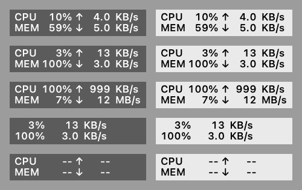

# MoBar

极简、美观的 macOS 原生任务栏状态监控 app。

菜单栏上两行两列，CPU 占用、内存占用、上下行网速一眼看完。没有窗口，没有设置页，没有 Dock 图标，零第三方依赖。



上图是内置的版式自检渲染（`MoBar --render`），左列模拟深色菜单栏、右列模拟浅色菜单栏，五行分别是：和 Mole for Mac 同值、上下排位数不同、最宽取值加单位切换、精简模式、数据断流占位。

```
CPU  14%  ↑ 3.0 KB/s
MEM  61%  ↓  13 KB/s
```

## 特点

**看得清。** 整块内容画成 template image 交给系统着色，而不是自己挑颜色。自绘颜色在多屏幕环境下会翻车：同一时刻标签在一块屏上是纯白、在另一块屏上亮度只有 0.443 而背景是 0.399，几乎看不见。交给系统之后深色、浅色、菜单展开时的高亮反色都一并处理掉。

**不抖不错位。** 等宽数字字体，各列位置由固定锚点反算：百分比右对齐、速率数字右对齐向左伸缩、单位列左缘锚死。数值从 `13 KB/s` 跳到 `3.0 KB/s`、从 `999 KB/s` 跳到 `12.3 MB/s`，单位都待在原地不动。

**默认不依赖任何外部进程。** 系统原生数据源直接读内核（`host_statistics` / `host_statistics64` / `getifaddrs`），2 秒一帧。也可以在菜单里切到 [mole](https://github.com/tw93/Mole) 的 `status-go` 作为数据源。

**小。** 1000 行 Swift，纯 AppKit，无第三方依赖，常驻内存约 48 MB、CPU 接近 0。

## 下载

[Releases](https://github.com/freebattle/mobar/releases) 里有编译好的通用二进制（arm64 + x86_64），160 KB，解压拖进「应用程序」就能用。

因为是 ad-hoc 本地签名、没走 Apple 公证，从浏览器下载的包带 quarantine 标记，首次打开会被 Gatekeeper 拦下。两种放行方式：

- 右键点 `MoBar.app` 选「打开」，在弹窗里再点一次「打开」
- 或者直接去掉标记：`xattr -dr com.apple.quarantine /Applications/MoBar.app`

不想跑来路不明的二进制，就照下面自己编，代码一共 1000 行。

## 自己编译

需要 macOS 13 或更新版本，以及 Xcode 命令行工具（`xcode-select --install`）。

```bash
git clone https://github.com/freebattle/mobar.git
cd mobar
./build-app.sh              # 只编当前架构，快
./build-app.sh --universal  # arm64 + x86_64 通用二进制
cp -R dist/MoBar.app /Applications/
open /Applications/MoBar.app
```

开机自启：系统设置 → 通用 → 登录项，添加 `/Applications/MoBar.app`。

## 用法

点菜单栏上的读数弹出菜单：

| 菜单项 | 快捷键 | 说明 |
| --- | --- | --- |
| 显示 CPU / MEM 标签 | `L` | 关掉就只剩百分比和网速，宽度从 113pt 收到 87pt |
| 数据源 → 系统原生 | | 默认，直接读内核 |
| 数据源 → mole status-go | | 改用 mole 的采样进程 |
| 重启数据源 | `R` | 数据卡住时用 |
| 退出 MoBar | `Q` | |

两个开关存在 UserDefaults 里，重启后保留。鼠标悬停有 tooltip，显示完整读数和当前数据源。超过 7 秒没有新样本会显示 `--` 占位，不会停在最后一帧骗人。

## 两种数据源

**系统原生**（默认）。`host_statistics(HOST_CPU_LOAD_INFO)` 取 CPU tick 差值，`host_statistics64(HOST_VM_INFO64)` 取内存页统计，`getifaddrs` 的 `AF_LINK` 取网卡字节计数器。两个口径上的选择值得说明：

- 内存用 `used = total - free - inactive`，和 mole（gopsutil）对齐，这样在两种数据源之间切换时数字不会跳。这不是活动监视器的口径，实测同一时刻活动监视器口径是 57.75%、这个口径是 60.43%。
- 网卡只统计名字是 `en* / eth* / bridge*` 且拿到了 IP 的接口。`utun` 系列 VPN 隧道会被排除，因为隧道流量同时也会走物理网卡，一起算就是双倍。

**mole status-go**。复用 [Mole CLI](https://github.com/tw93/Mole) 的采样进程，直接调 `/opt/homebrew/opt/mole/libexec/bin/status-go -watch -interval 2s` 读它的 NDJSON 输出。注意两点：不要走 `mo status --watch` 这个 shell 包装器，它在非 TTY 环境下会挂住；mole 的 JSON 不是对外承诺的稳定 API，字段随时可能变。用 `MOBAR_STATUS_BIN` 可以指定别的 status-go 路径。

## 开发

```bash
swift build -c release                      # 只编译
.build/release/MoBar --render /tmp/p.png     # 渲染版式自检图，不进事件循环
MOBAR_DEBUG=1 .build/release/MoBar           # 前台跑，每帧样本打到 stderr
```

版式自检图覆盖了几种会挤动布局的取值组合，改动渲染代码之后先看它。项目里几次错位问题都是靠这张图加逐像素测量抓出来的。

源码结构：

| 文件 | 职责 |
| --- | --- |
| `MenuBarRenderer.swift` | 两行内容画成 template image，版式锚点都在这里 |
| `NativeMetricsSource.swift` | 原生内核采样 |
| `MoleStatusSource.swift` | status-go 子进程 + NDJSON 解析 |
| `Metrics.swift` | `Sample` 结构、`MetricsSource` 协议、数值格式化 |
| `AppDelegate.swift` | NSStatusItem、菜单、断流判定 |
| `Settings.swift` | 两个开关的 UserDefaults 读写 |
| `Preview.swift` | 离屏版式自检 |

版式是拿 Mole for Mac 的菜单栏 HUD 截图逐像素量出来的：8.5pt 等宽数字（字重用 medium，比原版 regular 略粗），行距 9pt，百分比列右缘 48.1pt、速率数字列右缘 79.5pt、单位列左缘 83.5pt。垂直居中不是写死的补偿值，而是 init 时离屏画一帧量 ink 包围盒算出来的，换字号字重会自动跟上。

## 已知限制

- **上不了 App Store。** mole 数据源需要 spawn 子进程，App Sandbox 不允许，所以整个 app 没开沙盒。
- **没有公证。** ad-hoc 本地签名，不是开发者证书，所以下载后要手动放行一次。
- **x86_64 切片没在真 Intel 机器上跑过。** 通用二进制是在 Apple Silicon 上交叉编译的，x86_64 切片只经 Rosetta 验证过能启动、渲染输出和 arm64 一致。
- **单机口径。** 只报本机 CPU、内存、物理网卡速率，没有 GPU、温度、磁盘、进程列表。要这些用 `mo status`。

## 致谢

版式和内存口径参考了 [Mole](https://github.com/tw93/Mole)。菜单栏 HUD 是 Mole for Mac 的付费功能，MoBar 只是把这个两行版式在原生 AppKit 里复刻了一遍，数据默认自己采。

## License

MIT
